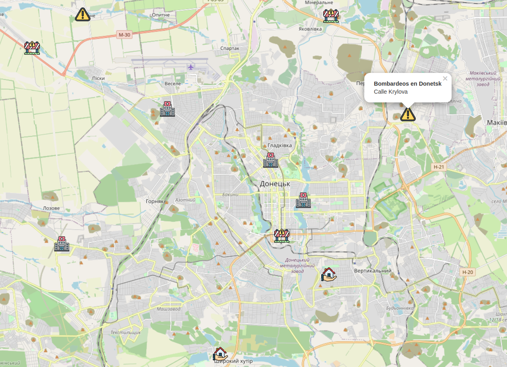

# HelpMap

## Disclaimer

This application as of now **does not reflect updated information**, please use other resources to access actual and accurate information.

## An interactive map for civilians to guide in the middle of war

**HelpMap shows real-time events around the civilian location** with the aim of helping people get **access to important information and resources** in a secure and fast manner.

As of now, four types of events have been implemented:

- Zones of active conflict
- Secure locations
- Hospitals
- Closed roads

## How it works

The map fetches real-time data from a database which includes:

- Basic info about the event
- The location of the event
- Latitude and longitude coordinates
- Type of event

## Technologies used

- Frontend: pure **HTML, CSS and JavaScript**, along with the **Leaflet** library that supports the creation of interactive maps.
- Backend: **NestJS**, a Node.js framework made on top of Express, uses TypeScript to support the building of highly scalable and testable applications.
- Database: **MongoDB**, a popular option for storing non-relational data.
